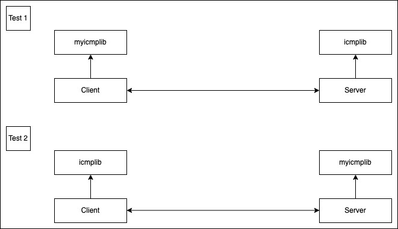

# netzwerk_programmierung

## Group: Gerland&Baylan

Murat Can Baylan  

Tayfun Gerland  


## Documentation 
for the code documentation google docstrings is used

## Project: ICMP (Internet Control Message Protocol)

RFC: https://datatracker.ietf.org/doc/html/rfc792

## Programmer language

- [x] python
- ~~[ ]  c~~

## System

linux (ubuntu 20.04)

## Software packages

python: icmplib 3.0.3  
https://pypi.org/project/icmplib/

import: socket  
https://docs.python.org/3/library/socket.html


## schedule

| Week | task | target  | definition of done  | open points | status |
|---|---|---|---|---| --- |
| 15 | creating a server with socket api   | successfully receive icmp packages from ping | The server should receive and respond to ping and traceroute packets. The sent data is output to the terminal and designed to be readable by humans  |   | done  |
| 16 | creating a client with icmplib  | A client with ICMPLIB will be implemented to provide the following functions: ping, traceroute  | The functions ping and traceroute can successfully send packets to the already implemented test server and the returned data will be displayed in the terminal.  |   | done |
| 17 | debug and testing (buffer) | debugging the code and make integration test for the communication between server and client  | All packets sent by the client can be exactly received by the server and also visually displayed. The client sends packets to the server and displays the data it receives back. |   | done |
| 18 | Start programming the own implementation of a ICMP server (library)  | Implementing the receiving and reply to ping and traceroute functions  | The server can receive and respond to ping and traceroute. The received data is displayed correctly and human-readable in the terminal. |   | in process  |
| 19 | work on the own implementation of a ICMP Server (buffer) | look at week 18  | see if points were forgotten in week 18  |   | done   |
| 20 | programming the own implementation of a ICMP Server (buffer) | look at week 18  | Implement tests for the server see if all data is received and output correctly |   | done |
| 21 | Start programming the own implementation of a ICMP client (library) | Start implementing functions to calculate checksums, ping and traceroute   |  Checksum is calculated correctly, ping and traceroute can be sent testwise |   | done  |
| 22 | work on own implementation of a ICMP client  | look at week 21  |   |   | done  |
| 23 | work on own implementation of a ICMP client  | TODO  |   |   | done  |
| 24 | work on own implementation of a ICMP client  | TODO  |   |   | done  |
| 25 | Write a test for the server | Communication with the ICMPLIB client should be successful  | The received data should be correct and human-readable output on the terminal.  |   | done  |
| 26 | Write a test for the client   | The client should start a communication with the test server, send the data and receive the returned data.  | The data is sent correctly the received data is correct and is output to the terminal in a human-readable form  |   | done  |
| 27 | create a presentation of the functionality  | An interesting and meaningful presentation is created. | Statement powerful images of functionality were inserted for presentation. The presented problems and their solutions are presented point by point. The classification of the individual members has been created. The presentation can be given freehand   |   | done  |

## Diagrams



## Setup
for installing requirements
```       
make init
```

## Usage
go to the directory of netzwerk_programmierung

to start the ICMP server from icmplib 
```
sudo python3 serverclient/icmplib/server.py
```
to start the ICMP client from icmplib 
```
sudo python3 serverclient/icmplib/client.py
```

start normal client without default parameters from icmplib 
```
sudo python3 serverclient/icmplib/client.py [-h] [-a ADDRESS] [-m MODE] [-c COUNT] [-i INTERVAL]
```

to start the gb_icmp server 
```
sudo python3 serverclient/gb_icmplib/gb_server.py
```

to start the gb_icmp client 
```
sudo python3 serverclient/gb_icmplib/gb_client.py
```
to use the multiping
```
sudo python3 serverclient/icmplib/gb_multiping.py [-h] [-a ADDRESSES] [-i INTERVAL] [-d DATA]
```
to use the ping
```
sudo python3 serverclient/icmplib/gb_ping.py [-h] [-a ADDRESS] [-c COUNT] [-i INTERVAL] [-d DATA]
```
to use traceroute
```
sudo python3 serverclient/icmplib/gb_traceroute.py [-h] [-a ADDRESS] [-p PORT] [-m MAX HOPS] [-i INTERVAL]
```
to use nmap
```
sudo python3 serverclient/icmplib/gb_nmap.py [-h] [-a ADDRESS] [-p PORT] [-i INTERVAL] [-s SCAN] [-P PING]
```

## Presentation
with terminal 1 (our icmplib)
```
cd master/netzwerk_programmierung/serverclient/gb_icmplib
```
with terminal 2 (other icmplib)
```
cd master/netzwerk_programmierung/serverclient/icmplib
```

### Demo1 
with terminal 1
```
sudo python3 gb_client.py
```
with terminal 2
```
sudo python3 server.py
```
### Demo2 
with terminal 1
```
sudo python3 gb_server.py
```
with terminal 2
```
sudo python3 client.py
```
### Traceroute 
```
sudo python3 traceroute.py -a google.com
```
### Nmap
```
sudo python3 gb_nmap.py -a scanme.nmap.org -PU -sU -i 3
```

```
sudo python3 gb_nmap.py -a scanme.nmap.org -PE -sT -i 3
```

### Ping / Multiping
```
sudo python3 gb_ping.py -a scanme.nmap.org -c 5
```

```
sudo python3 gb_multiping.py -a scanme.nmap.org,google.com,blumen.de
```
